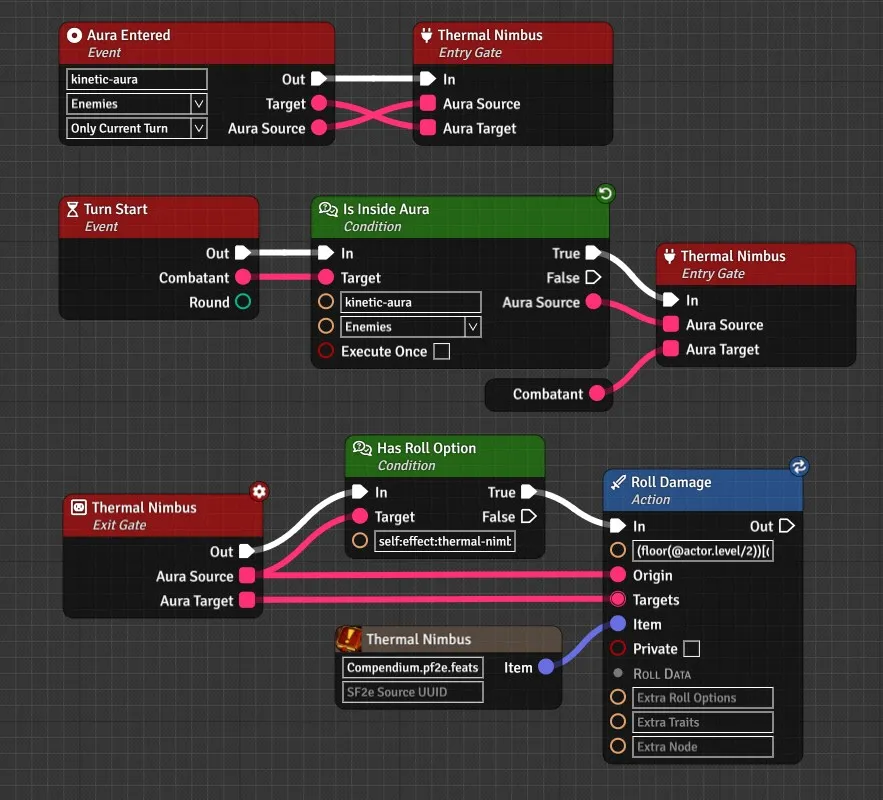

# FoundryVTT Trigger Engine

 or [Stripe](https://buy.stripe.com/cN23dy0hd0gW5nq3cc) directly

This module provides a node-base scripting to automate logic in foundry. It is comprised of 3 parts.

## Designing

Third party can design and register trigger applications, they define the building blocks of the triggers later created,
as well as the hooks that will control which triggers will be exectuted and when.

> [!IMPORTANT]
> When an application is registered with the module, a setting menu as well as a triggers setting are automatically added to the associated module.

> [!NOTE]
> This part is done programmatically and is not something most users will care for.

### Builtins

The module is bundled with already created (and system agnostic) nodes, entries, convertors and hooks that any application can decide to use.

### Pathfinder/Starfinder Second Edition

The module is bundled with a fully kitted application for those modules, it offers a lot of automation that the default system doesn't provide.

### Free Application

As opposed to a regular application, a free application doesn't add any setting and doesn't make use of trigger hooks.
Instead, it will allow you to use the blueprint menu directly to generate sequential data for any other use than automation.

## Building

This is the fun part, where a GM can create triggers using any registered application, playing with boxes and lines.
Simply add at least one even node (they are the entry point of an executed trigger) and follow with the other different nodes available to generate a trigger logic.

> [!NOTE]
> Third party can directly register triggers files to be loaded in your worlds, this allow modules to act as triggers "library" that GMs can then decide to enable or not in their world.

## Playing

While playing, the enabled triggers will be executed based on different actions/interactions with foundry.

The module is made so only what is absolutely necessary is running in the background, reducing its footprint to a minimum.
Any trigger that isn't enabled will be as though it wasn't in your world altogether.

# WIKI

You can find all the details about this module in its [WIKI](https://github.com/reonZ/trigger-engine/wiki)

# CHANGELOG

You can see the changelog [HERE](https://github.com/reonZ/trigger-engine/blob/master/CHANGELOG.md)
